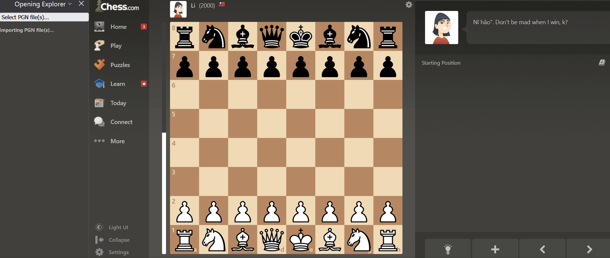

# Chess Opening Tree

Firefox sidebar add-on that shows possible next moves with their frequency from an input Portable Game Notation (PGN) database. This add-on only works during computer play. There is no technical limitation in adapting this to live chess, but that would be in violation of Chess.com's fair play policy.

Choose any PGN database you want, even your own games. Open like your favourite GM.

## Demo

## Requirements

### Temporary Add-on

This isn't published to the Firefox extension store. Load the manifest.json as a temporary add-on in `about:debugging#/runtime/this-firefox`.

### Move List

Must be visible. Don't use focus/full screen mode. This is how we scrape the board state during play.

### Piece Notation

Set to text mode (Nf3) instead of figurine notation ({knight-icon}f3).

## PGN sources

Places http://www.pgnmentor.com/files.html have collections of PGNs, or use the Chess.com API to get your own games (see [chesscom-pgn-collector.sh](tools/chesscom-pgn-collector.sh) for example).

A database of 30,000 games worked fine for me. This extension can probably handle a large database.
